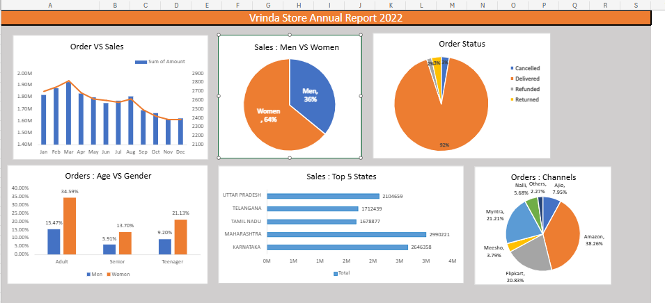

# Vrinda Store Sales Dashboard – 2022

## 📊 Project Overview
This project showcases a data analysis of Vrinda Store’s performance in 2022 using Excel. The dashboard visualizes key sales metrics such as order trends, buyer demographics, top contributing states, channels, and more.

Note: Pivot Charts were unavailable, so the dashboard uses standard Excel charts for visualization.

## Dataset
The dataset contains order and sales data for the year 2022. It includes information such as:
- Order status
- Gender and Age group of buyers
- Sales channel
- State-wise sales

File: Vrinda Store Data Analysis.xlsx`

---

## 📈 Dashboard Preview

---

## 🔍 Key Insights
- 👩‍🦰 **Women** contributed ~65% of purchases.
- 🏙️ Top 3 states: **Maharashtra, Karnataka, Uttar Pradesh** (~35%).
- 👨‍👩‍👧‍👦 **Adult age group (30–49 yrs)** contributed ~50%.
- 🛒 Top sales channels: **Amazon, Flipkart, Myntra** (~80%).

---

## 🧠 Sample Questions Addressed
- Which month had the highest sales and orders?
- Who purchased more – men or women?
- What are the order statuses?
- Top contributing states?
- Age and gender relationships?
- Which channels contributed the most?

---

## 🎯 Final Conclusion
To improve sales:
> Target **women** aged 30–49 in **Maharashtra, Karnataka, Uttar Pradesh**, through **Amazon, Flipkart, Myntra** promotions.

---

## 📌 Tools Used
- Microsoft Excel (2021 version)
- Standard Charts (due to Pivot Chart unavailability)
